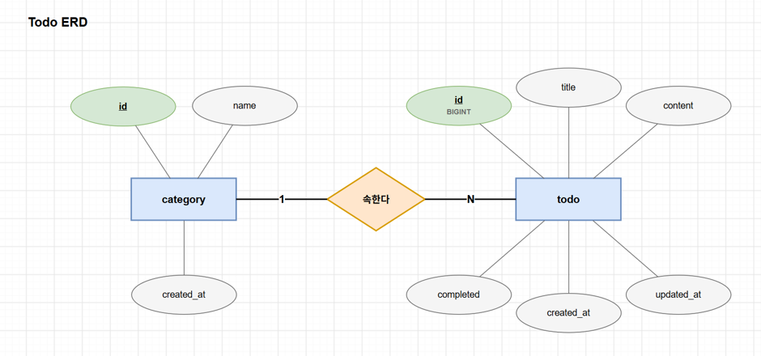

1.  **ER Diagram 그리기**

2.  **API 명세서 작성**

| **No** | **기능**                                    | **Method** | **Path**                      | **성공 코드** |
|--------|---------------------------------------------|------------|-------------------------------|---------------|
| 1      | 할 일 등록                                  | POST       | /api/todos                    | 201           |
| 2      | 할 일 목록 조회 (전체, 카테고리, 완료 여부) | GET        | /api/todos                    | 200           |
| 3      | 할 일 단건 조회 (id)                        | GET        | /api/todos/{todoId}           | 200           |
| 4      | 할 일 내용 수정 (제목, 내용)                | PATCH      | /api/todos/{todoId}           | 200           |
| 5      | 할 일 카테고리 설정                         | PATCH      | /api/todos/{todoId}/category  | 200           |
| 6      | 할 일 완료 / 미완료 변경                    | PATCH      | /api/todos/{todoId}/completed | 200           |
| 7      | 할 일 삭제                                  | DELETE     | /api/todos/{todoId}           | 204           |
| 8      | 카테고리 등록                               | POST       | /api/categories               | 201           |
| 9      | 카테고리 목록 조회                          | GET        | /api/categories               | 200           |
| 10     | 카테고리 삭제                               | DELETE     | /api/categories/{categoryId}  | 204           |

3.  **이번주 배운 내용 정리**

이번 세션에서의 핵심은 코드를 쓰기 전에 요구사항, Entity, ERD, API 명세서 순서로 설계를 먼저 끝낸다는 것이다.

**개발 과정**

설계: 요구사항 정리 → Entity 도출 → ER Diagram → API 명세서

구현: Entity → Repository → Service → Controller 순서

계층 사이의 데이터는 DTO로 전달

**계층 구조 (MVC 패턴)**

요청은 Client → Controller → Service → Repository → DB 순서로 흐르고, 응답은 반대 방향으로 돌아옴.

Controller : HTTP 요청을 받아 Service를 호출하고 응답을 돌려줌

Service : 비즈니스 로직 처리

Repository : DB 접근

Entity : DB 테이블과 매핑되는 객체

DTO : 계층 사이와 클라이언트에 주고받는 데이터 묶음

Entity를 그대로 응답하지 않고 DTO를 쓰는 이유는 테이블 구조가 바뀌어도 API 응답을 그대로 유지할 수 있고, 노출하면 안 되는 필드를 걸러낼 수 있어서

**API**

- API는 클라이언트와 서버가 데이터를 주고받는 약속 (Method, Path, 요청, 응답)

- HTTP 메서드는 동작을 나타냄

  - GET은 조회, POST는 생성, PATCH와 PUT은 수정, DELETE는 삭제

- API 명세서는 프런트엔드와 백엔드의 계약서

**Docker**

- 컨테이너는 프로그램과 실행 환경을 한데 묶어 격리된 상태로 실행하는 기술

- 이미지는 실행에 필요한걸 담은 템플릿이고 컨테이너는 그 이미지를 실행한 것

- MySQL 같은 DB를 PC에 직접 설치하지 않아도 띄우고 지울 수 있음

- 팀원 모두가 같은 버전과 같은 설정으로 개발하게 되어 개발 환경의 문제 해결

**Postman**

- API 요청을 직접 보내고 응답을 확인하는 도구로 프런트 화면이 없어도 응답의 상태 본문이 API 명세서와 같은지 확인하여 백엔드 API를 테스트 할 수 있음
