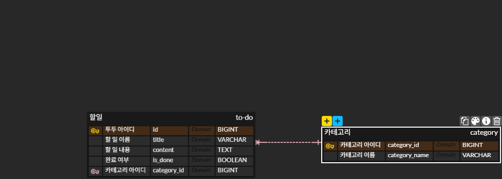

## API 명세서

| 기능 | HTTP 메서드 | 경로 |
|---|---|---|
| 할 일 등록 |POST |/api/todos |
| 할 일 전체 조회 |GET |/api/todos |
| 할 일 id로 조회 |GET |/api/todos/{id} |
| 카테고리별 조회 |GET |/api/todos?categoryId={categoryId} |
| 완료여부별 조회 |GET |/api/todos?isDone=true |
| 할 일 제목/내용 수정 |PUT |/api/todos/{id} |
| 카테고리 설정 |POST |/api/category |
| 카테고리 지정 |PATCH |/api/todos/{id}/category |
| 완료/미완료 변경 |PATCH |api/todos/{id} |
| 할 일 삭제 |DELETE |api/todos/{id} |

## 이번 세션에서 배운점
내가 생각했던 것보다 기능을 세분화한 뒤 명세서를 쓰는 것과 테이블 컬럼을 쓰는데에서 써야할것을 쓰지 못하는 실수를 한다는 사실을 알게되었고, 기초부터 연습하는 것이 중요하다는 사실을 깨달았습니다.