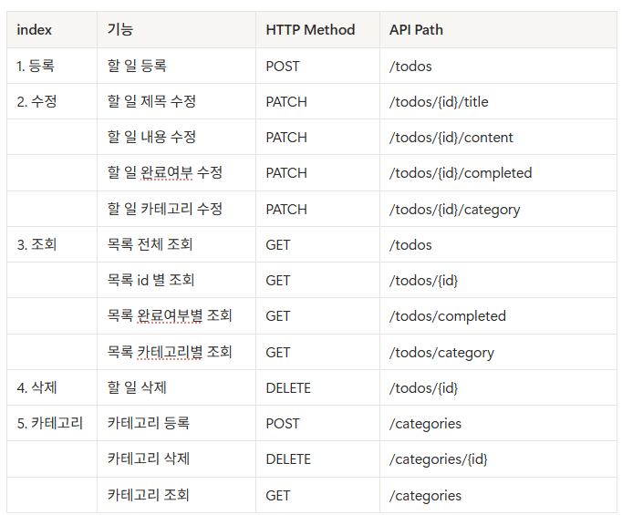

# 2주차
### 용어정리 및 배운 내용 정리
- Entity: DB에 저장할 데이터의 형태 
- Repository: DB 저장/조회/삭제 
- Controller: 클라이이언트의 요청을 받음 
- DTO: controller-service / service-repository 간에 정보를 주고 받을 때 파라미터로 받으면 처리하면 너무 많은 역할이 부여됨. 이를 방지하기 위해 DTO를 이용하는 것. 낱개로 처리하지 않고 하나의 package에 담아서 전달하는 것. 
- Service: 프로그램의 실제 기능 처리 
- ER-Diagram(Entity Relationship Diagram): DB의 구조와 테이블 관계 
  - PK(Primary Key): 각 데이터를 구분하는 기본키 
  - FK(Foreign Key): 다른 테이블을 참조하는 키
- API 명세서
  - index / 기능 / HTTP Method / API Path(*API path는 복수형, 명사 형태로 쓸 것) / (Request/Response까지 적으면 좋음)

- Image: 컨테이너를 만들기 위한 설계도
- Container: image를 실행한 것

- Docker
  - 사용이유: 개발환경을 맞추기 위해 사용
  - 핵심 3가지: ports / environment / volumes


### ER-Diagram
```mermaid
erDiagram
    CATEGORY ||--o{ TODO

    CATEGORY {
        Long id PK
        String name
    }

    TODO {
        Long id PK
        String title
        String content
        boolean completed
        Long category_id FK
    }
```


### API 명세서
